# SMS Gateway 客户操作指南

> **文档版本**：v1.1  
> **适用对象**：已开户的企业客户（短信 / 语音 / 数据等业务以账户开通为准）  
> **配套文档**：知识库中的《SMS Gateway HTTP与SMPP接口文档》PDF  
> **界面说明**：下文截图来自 **考拉出海** 客户门户（深色主题为示例，可切换浅色模式）。

---

## 1. 访问与登录

1. 在浏览器打开平台网址（由商务或客服提供，例如 `https://www.kaolach.com`）。
2. 进入 **登录** 页面，使用 **账户名或邮箱 + 密码** 登录。
3. 若已绑定 Telegram，可切换到 **TG 验证** 页签，按提示完成验证登录。
4. 完成 **滑动验证** 后点击 **客户登录**。
5. 登录成功后进入 **工作台**，左侧为功能菜单。

> **安全提示**：勿向他人泄露密码与 API 密钥；定期在 **账户 → 安全** 中检查登录相关设置。

### 1.1 登录界面示意

*图 1-1：登录页 — 客户登录 / TG 验证 切换，输入账号密码后滑动验证并登录。*

---

## 2. 工作台（仪表盘）

工作台（**仪表盘**）展示今日/本周/本月发送量、**账户余额**、**通道状态**、**最近发送**摘要及 **账户信息**（国家、单价等）。可通过 **快速操作** 一键进入发送短信、发送任务、发送记录、短信审核。

### 2.1 工作台界面示意

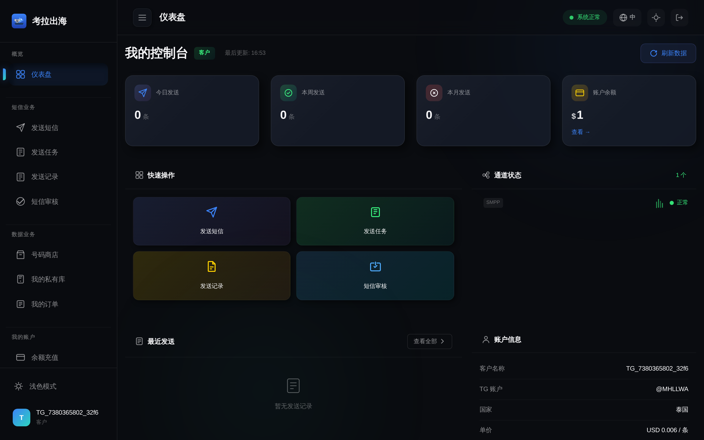

*图 2-1：仪表盘 — 数据概览与快捷入口。*

---

## 3. 短信业务

以下菜单在账户开通短信业务后可见（部分菜单依赖权限或配置）。

| 功能 | 路径说明 | 用途 |
|------|----------|------|
| 发送短信 | `/sms/send` | 单条或群发，模板变量、私库/号码商店导入等 |
| 短信模板 | `/sms/templates` | 维护常用模板 |
| 发送任务 | `/sms/tasks` | 批量任务创建与进度 |
| 定时任务 | `/sms/scheduled` | 预约发送（若开通） |
| 发送记录 | `/sms/records` | 历史记录筛选与状态查询 |
| 短信审核 | `/sms/approvals` | 内容审核流程（若启用） |
| 充值记录 | `/sms/recharge-records` | 充值与调账流水 |
| 发送统计 | `/sms/send-stats` | 多维度统计、趋势图与导出 Excel |
| 数据短信 | `/sms/data-send` | 结合数据能力发送（若开通） |

### 3.1 发送短信

页面顶部可查看今日发送、成功送达、成功率、今日消费等统计。中部填写 **短信内容**（可插入系统变量、保存草稿），在 **发送号码** 区选择手动输入、数据商店或私库导入，支持去重、错号过滤、TXT/Excel 导入。右侧为 **实时预览**（手机样式）。

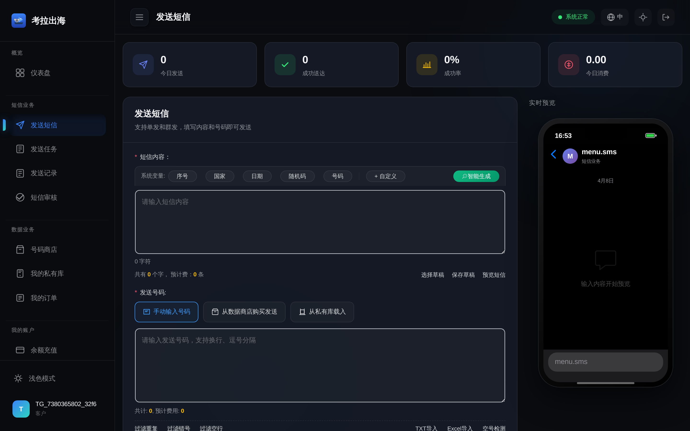

*图 3-1：发送短信。*

### 3.2 发送任务

用于创建与管理 **批量异步任务**，查看队列与处理进度（界面以实际部署为准）。

*图 3-2：发送任务。*

### 3.3 发送记录

可按 **手机号、发送 ID、状态、国家、日期范围** 筛选；顶部汇总总记录、已发送、已送达、失败、超时等数量。任务处理中时，部分号码可能显示为队列中，属正常现象。

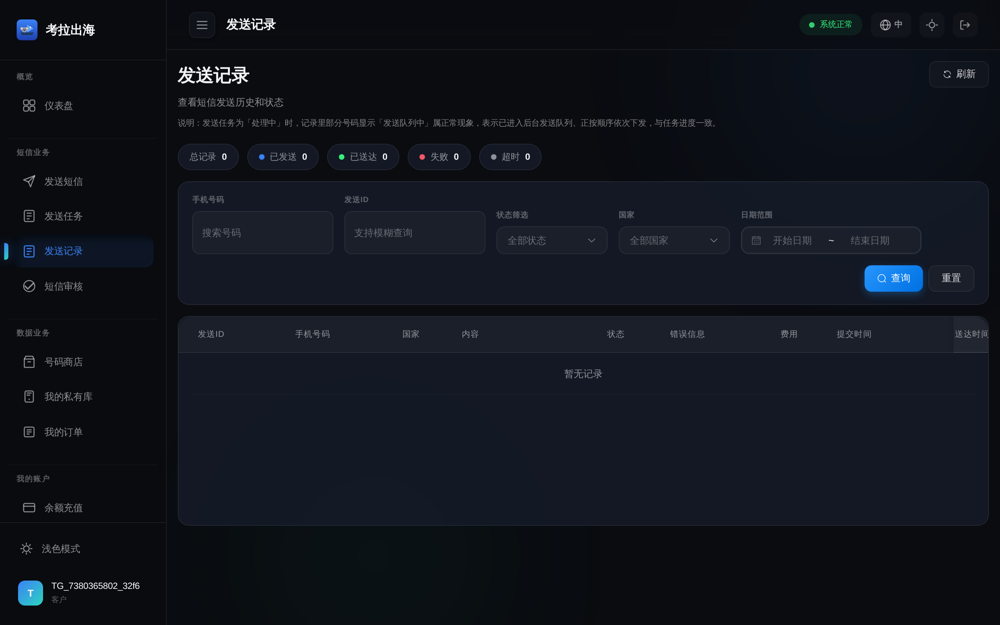

*图 3-3：发送记录。*

### 3.4 发送统计

支持 **分组维度**（如按账户、通道、国家、员工等）、日期快捷（今日、昨日、本周、本月、上月）、数据表格与趋势图，并可 **导出 Excel**。筛选后点击 **刷新** 更新数据。

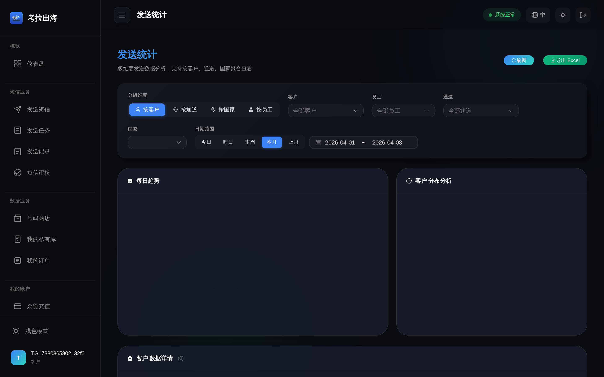

*图 3-4：发送统计。*

### 3.5 短信审核与充值记录

- **短信审核**：提交需审核的文案，审核通过后再执行发送（若贵司启用该流程）。  
- **充值记录**：查看账户侧短信相关充值与流水。

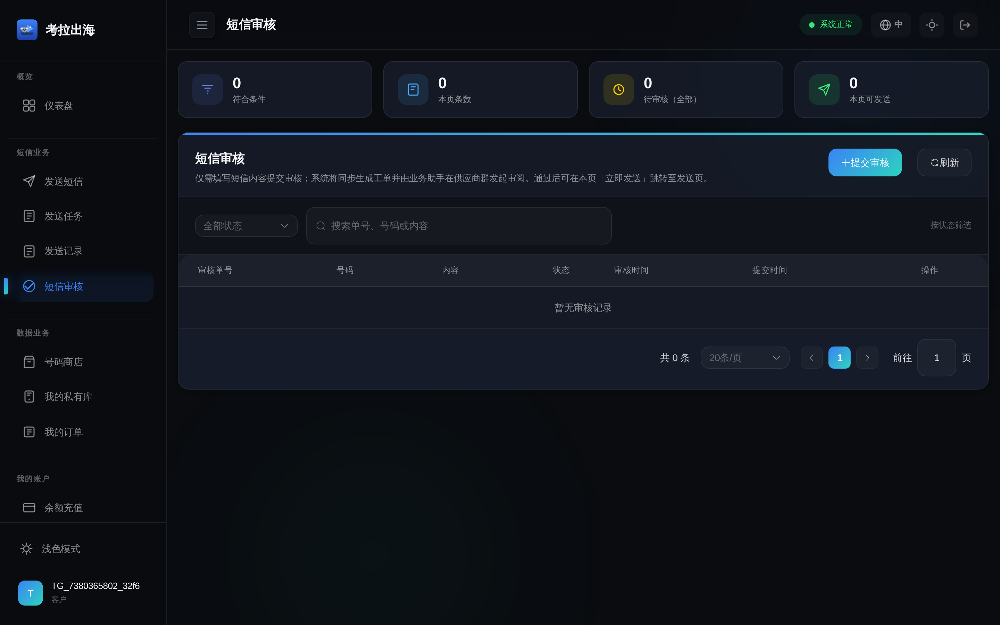

*图 3-5：短信审核。*

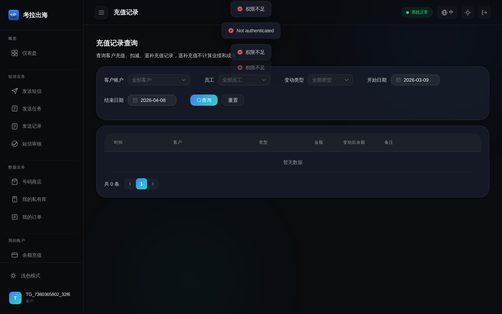

*图 3-6：充值记录。*

### 3.6 发送前注意

- 号码需符合 **E.164** 格式（一般带国际区号，如 `+66...`）。
- 内容需符合当地法规与运营商规范；营销类短信请确认已获用户同意。
- **余额不足** 时发送会失败，请先 **充值** 或联系对接人。

---

## 4. 通道管理

在 **通道** 菜单可查看与您账户相关的通道列表及状态（只读或受限编辑，以权限为准）。实际下发路由由平台策略决定。

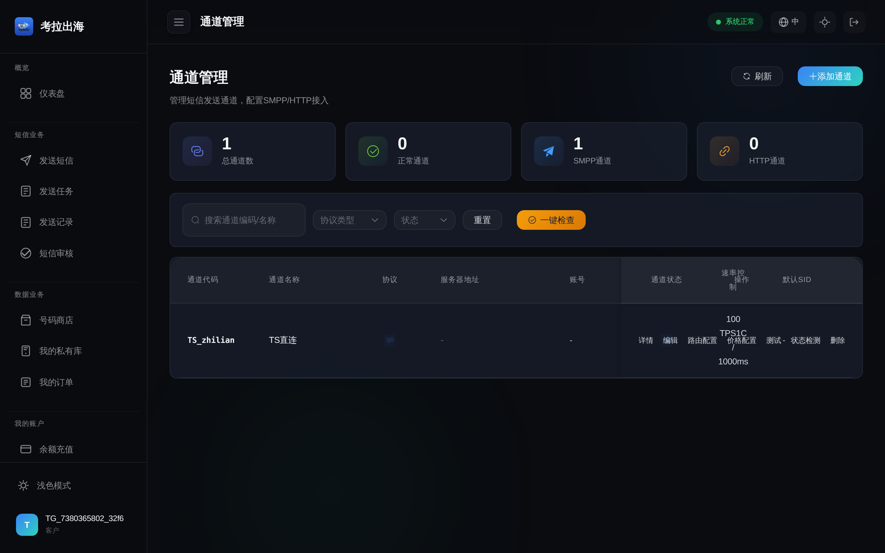

*图 4-1：通道管理。*

---

## 5. 账户中心

| 功能 | 路径说明 | 用途 |
|------|----------|------|
| API 密钥 | `/account/api-keys` | 创建与管理密钥、查看调用次数 |
| 账户管理 | `/account/settings` | 基本资料与联系方式 |
| 子账户 | `/account/sub-accounts` | 子账户（若开通） |
| 套餐 / 通知 / 安全 | 对应菜单 | 套餐、消息通知、密码与安全 |
| 余额充值 | `/account/balance` | 余额、阈值、联系商务充值 |
| 我的工单 | `/account/tickets` | 提交与跟踪工单 |

### 5.1 API 密钥

点击 **创建密钥** 可新增密钥；列表中可查看名称、权限、状态、调用次数及操作项。

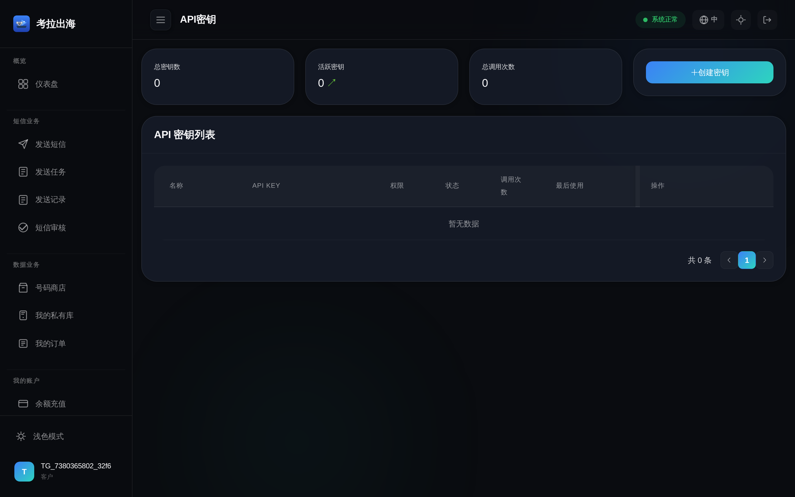

*图 5-1：API 密钥。*

### 5.2 账户设置

维护公司名称、联系人、通知偏好等（以页面字段为准）。

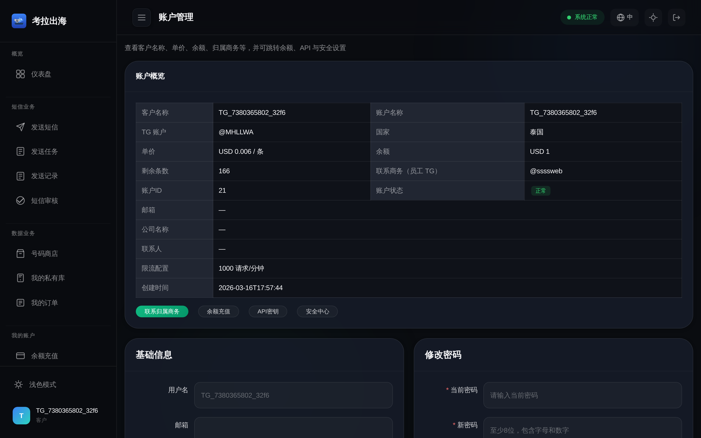

*图 5-2：账户设置。*

### 5.3 余额充值

查看 **当前余额**、**低余额阈值**；余额不足时会提示。充值一般通过 **联系商务充值** 完成，到账后即可正常使用。下方可查看 **近期交易**。

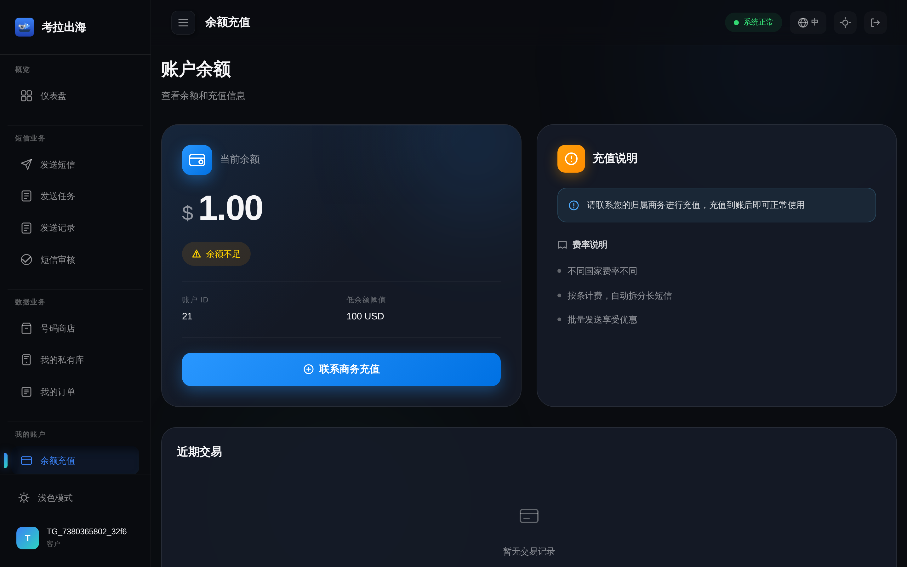

*图 5-3：余额充值。*

### 5.4 我的工单

用于提交问题、上传截图并与客服协同处理。

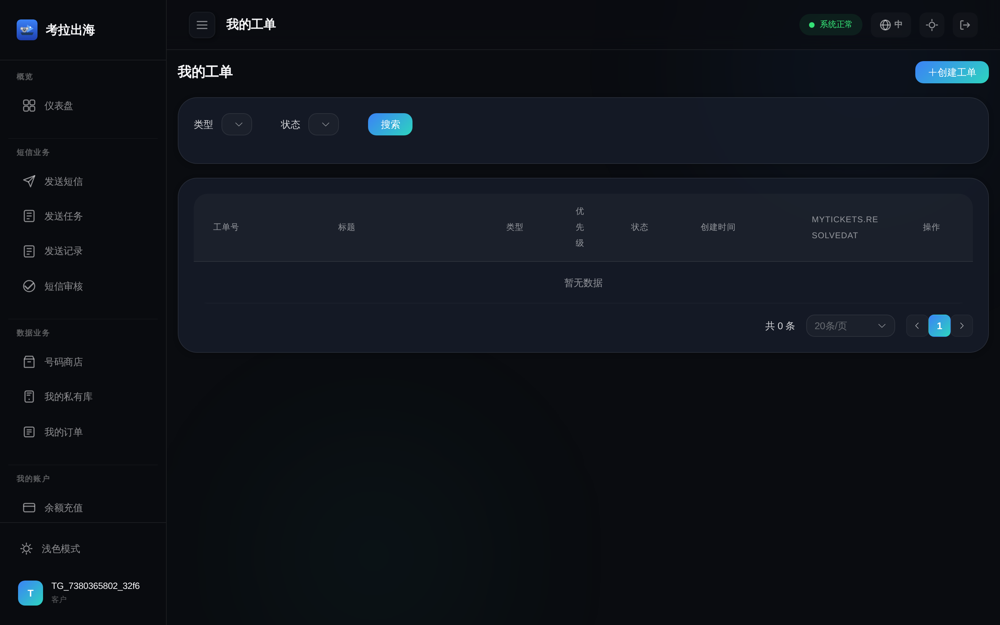

*图 5-4：我的工单。*

### 5.5 HTTP 对接认证方式

- **方式一（推荐）**：HTTP Basic Auth，用户名为 **账户名或邮箱**，密码为 **登录密码**。  
- **方式二**：请求头 `X-API-Key: ak_...`（与控制台创建的 API 密钥一致）。

详细 URL、请求体、批量接口、状态查询、Webhook 验签等请参阅知识库 **《SMS Gateway HTTP与SMPP接口文档》** PDF。

### 5.6 状态回调（Webhook）

若需送达结果主动推送，请向客服提供可公网访问的 **Webhook URL**，由后台为您的账户配置。回调体与 **HMAC 签名** 规则见接口文档。

---

## 6. 数据业务（若开通）

| 功能 | 路径说明 |
|------|----------|
| 号码商店 | `/data/store` |
| 我的私有库 | `/data/my-numbers` 或私库菜单（以侧边栏为准） |
| 我的订单 | `/data/orders` |

左侧 **数据业务** 分组内可进入上述功能（以实际菜单为准）。

---

## 7. 业务数据（销售看板）

部分账户可见 **业务数据** 类菜单，用于查看商务约定的统计视图（以菜单是否显示为准）。

---

## 8. 界面与主题

- 左下角可切换 **浅色 / 深色模式**。  
- 顶部可切换 **语言**（如中/英）。  
- 右上角显示 **系统状态**（如「系统正常」）及退出登录。

---

## 9. 常见问题

1. **登录失败**  
   检查账户名/邮箱与密码；尝试 **TG 验证** 或联系客服重置。

2. **发送失败提示余额不足**  
   在 **余额充值** 中查看余额，点击 **联系商务充值**。

3. **发送失败提示无通道 / 通道不可用**  
   通过 **我的工单** 或对接群反馈，并说明目标国家与内容类型。

4. **API 返回 401**  
   检查 API Key 或 Basic 认证是否正确；密钥是否在控制台处于 **活跃** 状态。

5. **统计与记录不一致**  
   统计可能存在延迟；对账以 **发送记录** 单条状态为准。

---

## 10. 获取帮助

- 使用 **我的工单** 提交问题并上传截图（可引用本指南中的界面名称）。  
- 联系您的 **客户经理** 或平台客服。  
- 技术对接请同时查阅知识库 **接口文档 PDF**。

---

**文档结束**
